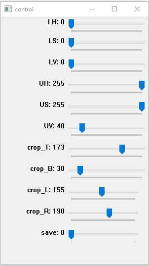
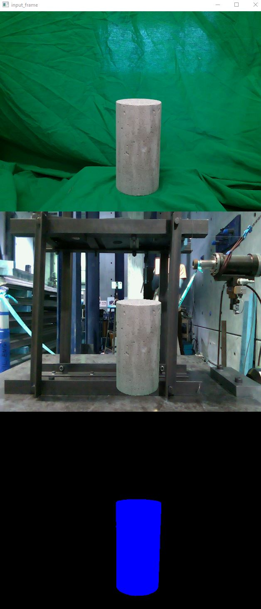

## Collect Segmentation Data Using Green Screen
These simple codes use OpenCV tools to create segmentation (ground truth) dataset. Press `ESC` to stop the code.

Create the output directories before running the code:

└───output
    ├───binary_mask
    ├───color_mask
    ├───input
    └───output

Input, output, and color-coded segmentation mask

